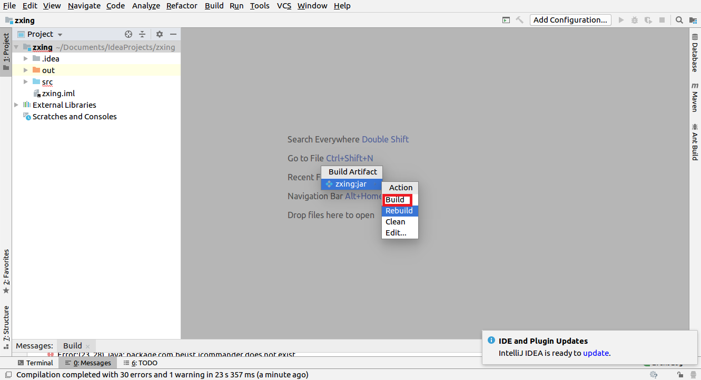

## 1.ZXing生成二维码

代码什么的就不说啦，说一下其他操作吧~

在IDEA里怎样导出jar包捏？

在eclipse里导出jar包就更简单了，可以百度一下哈~

首先下载zxing压缩包。[https://github.com/zxing/](https://github.com/zxing/)。然后解压哦，解压之后将文件夹里的core下的com包，和javase下的com包拷到工程目录src下，然后把这个工程生成jar包，不过编译过程中会报错，IDEA的话就无法生成jar包，目前我还不知道怎么解决；eclipse虽然也报错但是还是可以生成jar包，所以在eclipse下完成了这次实验。

实验结果如下：

解析二维码的结果如下：

其他的两种方式生成二维码：

使用QRCode方式生成和解析二维码
生成：http://www.swetake.com/qrcode/index-e.html
读取：https://osdn.jp/projects/qrcode/
使用jquery-qrcode生成二维码
https://github.com/jeromeetienne/jquery-qrcode